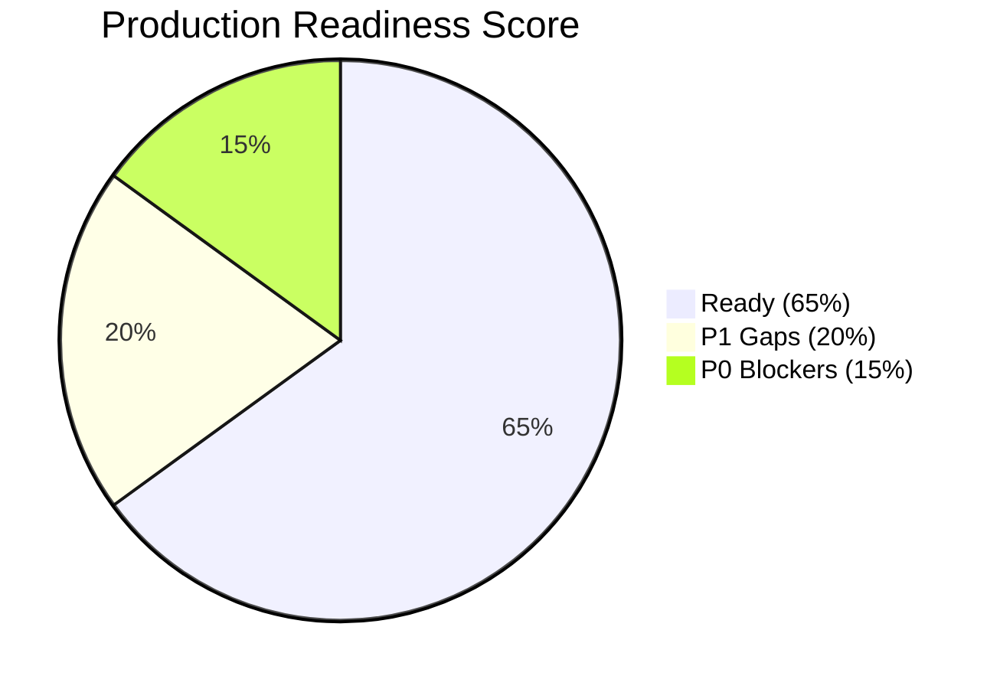
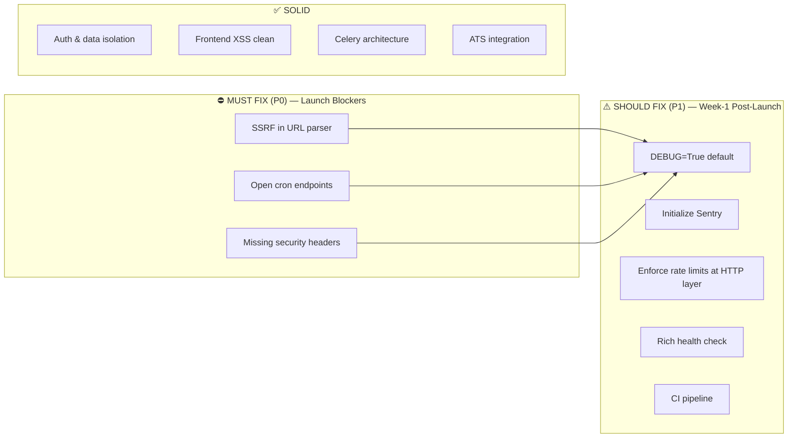

# 🚀 VeloxaHire — Production Readiness Report

**Date:** 2026-06-01  
**Scope:** Full-stack audit of `AI-Powered-JobHunt-Pro` (VeloxaHire candidate platform)  
**Verdict:** ⛔ **NOT PRODUCTION-READY** — original 2026-06-01 P0 blockers were confirmed at audit time; see the 2026-06-02 hardening update below.

## 2026-06-02 Hardening Update

The main engineering blockers from this report have now been addressed in the current worktree and tracked in `PRODUCTION_HARDENING_CHECKLIST_2026_06_02.md`.

Completed since the original report:

- SSRF guard for external job URL parsing: HTTPS-only default, DNS/IP blocking, redirect revalidation, and response byte cap.
- Cron endpoint hardening: `X-Cron-Secret` is now always required, and production config fails closed when `CRON_SECRET` is empty.
- API security headers middleware.
- Production config guardrails for `DEBUG`, wildcard hosts, and localhost/default CORS.
- Sentry initialization when `SENTRY_DSN` is configured.
- `/health` now checks database and Redis availability.
- Request-size limiter now rejects chunked request bodies without a content length.
- HTTP-layer rate limiting for scraping, external URL parsing/text parsing, recommendation regeneration, and cron routes.
- GitHub Actions CI for backend tests, frontend type-check, and frontend build.
- Frontend `error.tsx` and `global-error.tsx` boundaries.
- Production image remote patterns for Supabase and Clearbit logos.
- Public jobs route metadata.
- Migration numbering cleanup with a no-op `006` placeholder and removal of `migrations/test.py`.
- Privacy policy, terms of service, authenticated user data export, and authenticated account deletion workflow.
- Verification that public/non-expiring tailored CV URLs are not present in current runtime code because CV tailoring was removed in migration 007.
- Account deletion preserves shared job catalog integrity by detaching `jobs.added_by_user_id` rather than deleting job rows that may be referenced by other users.

Verified on 2026-06-02:

- `backend/venv/bin/python -m pytest tests/test_production_hardening.py -q` passed: 7 tests.
- `cd backend && venv/bin/python -m pytest tests/test_user_privacy.py tests/test_production_hardening.py -q` passed: 10 tests.
- `cd frontend && npm run type-check` passed.
- `cd backend && venv/bin/python -m py_compile app/api/v1/endpoints/users.py` passed.
- `cd frontend && npm run build` passed.
- `cd backend && venv/bin/python -m pytest -q` failed: 20 failed, 154 passed, 1 skipped, 21 errors. The failures are outside the new account export/deletion code and include existing missing fixtures and expectation drift in auth/CV/jobs/profiles/sanitizer tests.

Still left before production launch:

- Run the full backend test suite, frontend build, and deployment smoke tests after the remaining fixes.
- Repair the existing backend test suite failures so CI can become a reliable release gate.
- Verify Supabase Auth admin deletion in staging with the production service-role key configured.
- Review legal copy with counsel before public launch.

---

The original 2026-06-01 report below is retained as an audit snapshot. Statements that say the P0/P1 engineering blockers are still unfixed refer to that original audit date, not the current 2026-06-02 hardening status above.

## Executive Summary

VeloxaHire is a well-architected SaaS platform with strong product vision, clean separation of concerns, and a thoughtful feature set. However, it carries **three unresolved P0 security vulnerabilities** first flagged in the April 2026 audit, plus several P1 gaps in rate limiting, error tracking, security headers, and operational observability that would expose real users to material risk.

The system **can be made production-ready within 1–2 focused sprints** — the foundation is solid, and none of the issues require architectural rewrites.

---

## 1. 🔒 Security — Grade: D

This is the weakest dimension. Three known P0 vulnerabilities from the April 2026 audit remain **unfixed**.

### P0-1: SSRF via External Job URL Parser ⛔

> [!CAUTION]
> **File:** [external_job_parser.py](file:///home/grejoy/Projects/AI-Powered-JobHunt-Pro/backend/app/services/external_job_parser.py)
>
> Any authenticated user can supply an arbitrary URL to `/api/v1/jobs/external/from-url`. The parser fetches that URL via `httpx` with `follow_redirects=True`, no scheme allowlist, no DNS/IP filtering, and no redirect validation. An attacker can:
> - Hit internal services (e.g., `http://169.254.169.254/` for cloud metadata)
> - Reach `localhost`/loopback/private IPs
> - Probe internal infrastructure behind NAT
>
> **Impact:** Full SSRF — credential theft from cloud metadata endpoints, internal service enumeration.

**What's needed:**
- Scheme allowlist (`https://` only, possibly `http://` with explicit opt-in)
- Pre-connect DNS resolution → reject private/loopback/link-local/multicast/metadata IPs
- Post-redirect IP re-validation
- Response size limit (currently unbounded via Jina Reader fallback with 30s timeout)
- Per-user rate limit on URL parsing

---

### P0-2: Cron Endpoints Open Without Authentication ⛔

> [!CAUTION]
> **File:** [jobs.py](file:///home/grejoy/Projects/AI-Powered-JobHunt-Pro/backend/app/api/v1/endpoints/jobs.py#L328-L386)
>
> `/api/v1/jobs/cleanup-old` and `/api/v1/jobs/recommendations/generate-all` only check `CRON_SECRET` **if it is set**. If the env var is empty (the default), these endpoints are fully public — no auth required. In production, an attacker can:
> - Trigger mass job deletion via cleanup
> - Trigger expensive AI recommendation generation (cost abuse)

**What's needed:**
- Fail startup in production if `CRON_SECRET` is empty
- Or require `get_current_user` + admin role as fallback

---

### P0-3: No Security Headers ⛔

> [!WARNING]
> The backend sets **zero security response headers**. No `Content-Security-Policy`, `X-Frame-Options`, `X-Content-Type-Options`, `Strict-Transport-Security`, or `Referrer-Policy`. The frontend (Vercel) may add some via platform defaults, but the API is completely unprotected.

**What's needed:** Add a middleware that sets standard security headers on all responses.

---

### P1 Security Findings

| # | Finding | File(s) | Severity |
|---|---------|---------|----------|
| S1 | `DEBUG=True` is the default — exposes validation error details, enables Swagger docs in production if not explicitly set | [config.py:26](file:///home/grejoy/Projects/AI-Powered-JobHunt-Pro/backend/app/core/config.py#L26) | P1 |
| S2 | `ALLOWED_HOSTS=["*"]` default — `TrustedHostMiddleware` is effectively disabled even if `DEBUG=False` | [config.py:103-104](file:///home/grejoy/Projects/AI-Powered-JobHunt-Pro/backend/app/core/config.py#L103-L104) | P1 |
| S3 | `CORS_ORIGINS` defaults to `localhost:3000` — acceptable for dev, but production must be explicitly restricted | [config.py:99-101](file:///home/grejoy/Projects/AI-Powered-JobHunt-Pro/backend/app/core/config.py#L99-L101) | P1 |
| S4 | Request size limit only checks `Content-Length` header — chunked `Transfer-Encoding` bypasses the check entirely | [request_size_limit.py:31-52](file:///home/grejoy/Projects/AI-Powered-JobHunt-Pro/backend/app/middleware/request_size_limit.py#L30-L53) | P1 |
| S5 | Prompt injection defense is regex-based redaction only — sophisticated attacks will bypass it | [sanitizer.py](file:///home/grejoy/Projects/AI-Powered-JobHunt-Pro/backend/app/utils/sanitizer.py) | P2 |
| S6 | Sentry DSN is configured in settings but **never initialized** — errors in production disappear silently | [config.py:112](file:///home/grejoy/Projects/AI-Powered-JobHunt-Pro/backend/app/core/config.py#L112) | P1 |

---

## 2. 🏗️ Infrastructure & Reliability — Grade: C+

| Aspect | Status | Notes |
|--------|--------|-------|
| Hosting | ✅ Render (backend) + Vercel (frontend) | Proven platforms |
| Database | ✅ Supabase PostgreSQL | Managed, auto-backups |
| Cache/Queue | ✅ Redis + Celery | Proper async architecture |
| Scheduler | ✅ Celery Beat | In-process APScheduler removed |
| Health check | ✅ `/health` endpoint exists | Basic — no DB/Redis connectivity check |
| Error tracking | ❌ Sentry configured but **not initialized** | Errors vanish in production |
| Logging | ⚠️ `structlog` used, file-based `backend.log` | No log aggregation service |
| Rate limiting (API) | ❌ Declared in config, **not enforced** at HTTP layer | AI usage tracker has in-memory tracking only |
| Rate limiting (scraping) | ❌ `SCRAPING_RATE_LIMIT_PER_MINUTE` declared, not enforced | Any user can trigger unlimited scraping |
| Backups | ✅ Supabase handles DB backups | |
| CI/CD | ❌ No CI pipeline in repository | Manual test runs only |

> [!IMPORTANT]
> **The health check at `/health` returns `{"status": "healthy"}` unconditionally** — it doesn't verify database connectivity, Redis availability, or Supabase reachability. A "healthy" response could mask a completely broken backend.

---

## 3. ⚙️ Backend Architecture — Grade: B+

### What's Working Well ✅

- **Clean separation**: FastAPI + SQLAlchemy + Celery is a solid, proven stack
- **Auth dependency injection**: `get_current_user` / `get_optional_user` pattern is clean
- **Local JWT verification**: Reduces Supabase API dependency (added `SUPABASE_JWT_SECRET` support)
- **Ownership filtering**: All user-data endpoints correctly filter by `user_id` 
- **CV signed URLs**: Download endpoint uses time-limited signed URLs (1-hour expiry) ✅
- **Input sanitization**: Comprehensive `DataSanitizer` class with prompt injection detection
- **Model validation**: Pydantic models with proper field validators
- **ATS integration**: Well-designed sync service with idempotent upserts

### Concerns ⚠️

| # | Issue | Detail |
|---|-------|--------|
| A1 | `ILIKE` search with `%user_input%` | Full table scans on `jobs` table — will degrade as data grows. No GIN/trigram index. |
| A2 | No pagination guard | `search_jobs` allows `page_size=100` — combined with `ILIKE` this can be slow |
| A3 | Migration numbering gap | Migrations jump from `005` to `007` (no `006`). `test.py` is in the migrations folder. |
| A4 | Schema drift | `docs/SUPABASE_SETUP_COMPLETE.sql` likely doesn't match the current state after migrations 007–010 |
| A5 | CV parsing is synchronous | Despite the comment "in production, use Celery task", parsing happens in the upload request handler |
| A6 | No user deletion cascade | No endpoint or process to delete user data + derived files (tailored CVs, embeddings, recommendations) |

---

## 4. 🎨 Frontend & UX — Grade: B+

### What's Working Well ✅

- **Modern stack**: Next.js 14 App Router, TypeScript, Tailwind, Framer Motion
- **Auth flow**: Supabase SSR + browser clients properly separated
- **No `dangerouslySetInnerHTML`**: ✅ The previously flagged instance has been **removed** — zero occurrences found
- **Public job browsing**: Anonymous users can browse and apply, with a thoughtful `PostApplyModal` signup CTA
- **Type safety**: Zod + react-hook-form + zustand — well-typed data flow
- **API client layer**: Centralized in `frontend/lib/api/` with typed functions

### Concerns ⚠️

| # | Issue | Detail |
|---|-------|--------|
| F1 | No frontend test suite | No Jest, Vitest, or Playwright — only `type-check` and `build` gate the frontend |
| F2 | `next.config.js` images domains only allows `localhost` | Won't load external images (company logos, etc.) in production |
| F3 | No `<meta>` or SEO tags visible in config | Should have per-page metadata for public job pages |
| F4 | No error boundary | React error boundaries not visible — JS crashes would show a white screen |

---

## 5. 📊 Data Integrity — Grade: B

| Aspect | Status | Notes |
|--------|--------|-------|
| User data isolation | ✅ All queries filter by `user_id` | Verified across CVs, applications, profiles, scraping jobs |
| Job deduplication | ✅ Unique constraint on `(origin_system, origin_job_id)` for ATS jobs | Scraped jobs use `source_id` |
| Old job cleanup | ✅ 7-day cleanup for scraped jobs, external jobs preserved | Via Celery task |
| Saved job expiry | ✅ 10-day auto-expiry on saved jobs | Good UX decision |
| Saved jobs cap | ✅ Hard limit of 20 saved jobs per user | Prevents abuse |
| Application status | ✅ Validated against allowed enum set | `saved, applied, dismissed, hidden, interviewing, rejected, offer` |
| CV storage | ✅ Supabase bucket with user-scoped paths | `{user_id}/{file_id}.pdf` |
| WhatsApp rate limits | ✅ Per-user and global caps + idempotent delivery | Well-guarded |

> [!NOTE]
> Data isolation is solid. The main risk is **schema drift** between the SQL setup script and the actual migrations — a fresh deploy from `docs/SUPABASE_SETUP_COMPLETE.sql` would miss migrations 007–010.

---

## 6. 🧪 Testing & CI — Grade: C

| Aspect | Status |
|--------|--------|
| Backend test files | 12 active test files (auth, CVs, jobs, profiles, AI router, sanitizer, recommendations, WhatsApp, ATS sync, periodic tasks) |
| Backend coverage | Coverage configuration exists (`pyproject.toml`) |
| Disabled test files | 3 `.bak` files (test_cvs, test_jobs, test_profiles) — disabled due to model drift |
| Known flaky tests | `test_ai_router.py` leaks real AI keys |
| Frontend tests | ❌ **None** — no test runner configured |
| CI pipeline | ❌ **None** — no GitHub Actions, no pre-commit hooks |
| E2E tests | ❌ **None** — no Playwright/Cypress |

> [!WARNING]
> There is **no automated gate** between a code push and production deployment. Any engineer can push broken code directly to `main`, and it deploys to Render/Vercel without any check.

---

## 7. 📋 Operational Maturity — Grade: C

| Aspect | Status | Notes |
|--------|--------|-------|
| Deployment docs | ✅ Render + Vercel docs exist | `docs/deployment/` |
| Environment config | ✅ `.env.example` with 3.6KB of documented variables | Good onboarding |
| Monitoring | ❌ No APM, no metrics, no dashboards | Sentry configured but uninitialized |
| Alerting | ❌ No alerting on errors, latency, or job failures | |
| Log aggregation | ❌ Logs go to file and stdout only | No Datadog/CloudWatch/Logtail |
| Runbooks | ❌ No incident response documentation | |
| Privacy policy | ❌ No terms of service or privacy policy | Required for public SaaS |
| GDPR/data deletion | ❌ No user data export or deletion endpoint | |
| Rate limit visibility | ❌ No admin dashboard for API usage | |
| ATS sync observability | ❌ No dashboard for sync status/errors | Noted in MEMORY.md §10 |

---

## Final Verdict

---

## 🔴 Must-Fix Before Launch (P0 Checklist)

- [ ] **SSRF guard** — Add URL validation (scheme, DNS, IP, redirects, size) to `external_job_parser.py`
- [ ] **Cron auth enforcement** — Fail startup if `ENVIRONMENT=production` and `CRON_SECRET` is empty
- [ ] **Security headers middleware** — CSP, HSTS, X-Frame-Options, X-Content-Type-Options, Referrer-Policy
- [ ] **Set `DEBUG=False` by default** — Or fail startup in production if `DEBUG=True`
- [ ] **Privacy Policy & Terms of Service** — Legal requirement for any public SaaS handling user data

---

## 🟡 Strongly Recommended for Week 1 (P1)

- [ ] Initialize Sentry SDK in `main.py` when `SENTRY_DSN` is set
- [ ] Add HTTP-layer rate limiting (e.g., `slowapi` or Redis-backed middleware) for AI, scraping, and external job endpoints
- [ ] Enrich `/health` to check DB + Redis connectivity
- [ ] Set up GitHub Actions CI: lint → type-check → backend tests → frontend build
- [ ] Fix chunked transfer-encoding bypass in request size limiter
- [ ] Reconcile migration files with `SUPABASE_SETUP_COMPLETE.sql`
- [ ] Add React error boundary in the dashboard layout
- [ ] Add basic SEO metadata to public job pages

---

## 🟢 Post-Launch Improvements (P2)

- [ ] Move CV parsing to Celery task (async)
- [ ] Add GIN/trigram index for job search
- [ ] Add user data deletion endpoint (GDPR)
- [ ] Set up log aggregation (e.g., Logtail, Datadog)
- [ ] Build ATS sync observability dashboard
- [ ] Add E2E browser tests (Playwright)
- [ ] Implement frontend test suite

---

> [!IMPORTANT]
> **Bottom line:** The application has strong bones — good auth patterns, clean code, proper async architecture, solid data isolation, and a thoughtful UX. But the three P0 security issues (SSRF, open cron, no security headers) are **genuine risks to real users and your infrastructure**. Fix those, flip `DEBUG=False`, add a privacy policy, and you're cleared for a soft launch.
